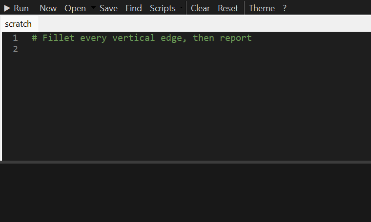

# SwPy — Python for SOLIDWORKS


[](https://github.com/muerus/SolidWorks-Python/releases/latest)
[](https://muerus.github.io/SolidWorks-Python/)

SwPy embeds real CPython **inside SOLIDWORKS**. Write and run Python against the live SOLIDWORKS API
from a task-pane IDE, use a Pythonic layer for everyday jobs, install any pip package, and drive
SOLIDWORKS from Jupyter or other applications.

```python
# r: openpyxl                                      # pip packages on demand
with model.batch():                                # many edits, one rebuild
    model.dims["D1@Boss-Extrude1"] = 25 * mm       # SI units, no casts
    model.globals["Width"] = 120 * mm
model.faces.planar().normal(Z).largest().select()  # geometry queries
print(model.mass["mass"], "kg")
```

<p align="center"></p>

## Contents

- [Features](#features)
- [Requirements](#requirements)
- [Installation](#installation)
- [Quick start](#quick-start)
- [Documentation](#documentation)
- [How it works](#how-it-works)
- [Project structure](#project-structure)
- [Development](#development)
- [Security](#security)
- [Changelog](#changelog)
- [License](#license)

## Features

**In-process Python**
- CPython 3.12 running inside `SLDWORKS.exe` via pythonnet: API calls take microseconds, not the
  hundreds of milliseconds of out-of-process COM.
- Ships its own embeddable Python runtime; no Python install and **no admin rights** needed.
- Persistent sessions, live `print` output, notebook-style results, tracebacks that show only your code.

**Task-pane IDE**
- Tabs, recent files and automatic backups of untitled scripts.
- **IntelliSense from the live session**: completion for real objects (`doc.`, `model.`, `swconst.`),
  following SOLIDWORKS API return types without running anything. Also signature help, hover info, and
  **F1 → official API help**.
- Syntax checking as you type, runtime errors marked on the failing line, and double-click on a
  traceback line to jump to it.
- Find/replace with regex, go to line, multi-caret editing, comment toggle, line moves, code folding,
  brace matching, auto-closing pairs.
- Light and dark themes, a REPL with history and Tab completion.

**Pythonic API** (`swpy.model`)
- SI units everywhere: `30 * mm`, `to(value, deg)`.
- Dimensions and global variables as dictionaries, and `model.batch()` for one rebuild after many edits.
- Mass properties, features, default planes that work with any template.
- Chainable face/edge queries: `model.faces.cylindrical().radius(5 * mm).edges.circular().select()`.
- Build geometry: `with model.sketch(model.planes.front) as s: s.rect(...)`, `model.extrude(s, 20 * mm)`,
  `cut`, `revolve`, `fillet`, `chamfer`, `shell`; assemblies (`add_component`, `mate`, `bom`); drawings
  (`create_drawing`) and `model.export("part.step" | "drawing.pdf" ...)`.

**Full SOLIDWORKS API**
- Automatic typing: no casts. Objects expose the members of every interface they implement.
- All enums (`swconst`), typed casts (`sldworks.IFoo`), Python lists for arrays, tuples for
  out-parameters.
- **Every SOLIDWORKS API library**: Simulation, Motion, DimXpert, Routing, Costing, PDM, Document
  Manager, Utilities, Toolbox ... (`cosworks.ICosmosWorks(obj)`, `swcommands.swCommands_e`).

**Events**
- `@on(doc, "rebuild")`, `on(sw, "active_doc", fn)`: Python handlers for any SOLIDWORKS event, isolated
  from errors and removed automatically on Reset, document close and unload.

**Tools for your team**
- Every `.py` in `Documents\SwPy\Scripts` becomes a one-click tool (pane menu; SwPy toolbar and
  CommandManager tab with a machine-wide install); `startup\` scripts run when SOLIDWORKS starts.
- `ui.progress` (Esc cancels long loops), `ui.message`, `ui.ask`, `ui.prompt`, file and folder dialogs.

**Packages and automation**
- `# r: numpy, pandas` installs pip packages per user on first run.
- `swpy.client`: drive SOLIDWORKS from Jupyter or any Python. Excel VBA and C# can call the same COM
  entry point.

## Requirements

| | |
|---|---|
| OS | Windows 10/11 x64 |
| SOLIDWORKS | 2020 or newer (developed and tested on 2020 SP1) |
| Python | none for users (bundled 3.12); Python 3.10+ with `pywin32` for the remote client |
| Rights | standard user; admin only for optional machine-wide auto-load |

## Installation

1. Download **SwPy-x.y.z.zip** from the [latest release](https://github.com/muerus/SolidWorks-Python/releases/latest)
   and unzip it to a permanent folder (e.g. `%LOCALAPPDATA%\Programs\SwPy`), or [build from source](#development).
2. In that folder, register SwPy for your Windows user and create the **SOLIDWORKS + SwPy** shortcut:

   ```powershell
   powershell -ExecutionPolicy Bypass -File tools\install.ps1
   ```

3. Start SOLIDWORKS with the **SOLIDWORKS + SwPy** shortcut and open the **SwPy - Python** tab of the
   task pane.

Options: `-Machine` also registers SwPy machine-wide, so SOLIDWORKS loads it at every start (needs
admin). `-Uninstall` removes everything.

## Quick start

Open a part, type into the editor and press **F5**:

```python
for f in model.features():
    print(f.GetTypeName2().ljust(16), f.Name)
print("volume:", round(to(model.mass["volume"], mm**3)), "mm^3")
```

From Jupyter or another Python (`pip install -e .[client]` from this repository):

```python
import swpy.client as swc
sw = swc.connect()
sw.eval("model.mass['mass']")        # -> 0.12
```

## Documentation

The **[user guide](docs/guide/README.md)** (also as a website: **https://muerus.github.io/SolidWorks-Python/**) covers everything:

| | |
|---|---|
| [Getting started](docs/guide/01-getting-started.md) | Install, first script, where files live |
| [The editor](docs/guide/02-editor.md) | IntelliSense, shortcuts, tabs, find/replace |
| [Scripting basics](docs/guide/03-scripting-basics.md) | Predefined names, sessions, output, units |
| [The model API](docs/guide/04-model-api.md) | Dimensions, globals, batch, mass, face/edge queries |
| [SOLIDWORKS API from Python](docs/guide/05-solidworks-api.md) | Auto-typing, casts, enums, arrays, out-parameters, porting VBA |
| [Packages](docs/guide/06-packages.md) | `# r:` requirements |
| [Remote control](docs/guide/07-remote-control.md) | Jupyter, scripts, Excel, C# |
| [Recipes](docs/guide/08-recipes.md) | Parts from scratch, studies, exports, properties, assemblies |
| [Troubleshooting](docs/guide/09-troubleshooting.md) | Logs and common errors |
| [Events](docs/guide/10-events.md) | Handlers for rebuilds, saves, selections, document switches |
| [Script buttons and UI](docs/guide/11-scripts-and-ui.md) | Script folder, buttons, startup scripts, progress (Esc cancels), dialogs |
| [Building models](docs/guide/12-building-models.md) | Sketches, features, assemblies and mates, drawings, export |
| [API reference](docs/guide/api-reference.md) | Every public class and function |

Every runnable example in the guide is executed against SOLIDWORKS by the test suite.

## How it works

```
SOLIDWORKS (SLDWORKS.exe, .NET Framework 4.8)
 └─ SwPy.AddIn (C#)  ── task pane IDE (WinForms + Scintilla)
     │                └─ COM entry point Execute(session, code)  ◄── swpy.client / Excel / C#
     └─ pythonnet ──► CPython 3.12 (bundled)
                        ├─ swpy._host     sessions, output, errors, # r: packages
                        ├─ swpy._editor   completion, signatures, hover, syntax check
                        ├─ swpy.com       auto-typed COM proxies
                        └─ swpy.model     Pythonic layer (units, dims, globals, queries)
```

Design notes and research findings: [docs/ARCHITECTURE.md](docs/ARCHITECTURE.md) and
[docs/RESEARCH.md](docs/RESEARCH.md).

## Project structure

```
├── src/
│   ├── SwPy.AddIn/          C# add-in: COM registration, Python host, task-pane IDE (Ui/)
│   └── SwPy.Launcher/       starts SOLIDWORKS and loads the add-in (per-user installs)
├── python/swpy/             the Python package (runs inside SOLIDWORKS; client.py runs anywhere)
├── tests/                   live pytest suite (drives a real SOLIDWORKS)
├── tools/                   install/register scripts, runtime fetcher, interop generator
├── docs/
│   ├── guide/               user guide and API reference
│   ├── ARCHITECTURE.md      layers and milestones
│   └── RESEARCH.md          findings that shaped the design
├── pyproject.toml           package metadata (editable install for the client / dev tools)
├── CHANGELOG.md
├── CONTRIBUTING.md
└── LICENSE
```

## Development

```powershell
py -3.12 -m venv .venv; .venv\Scripts\pip install -e .[dev]
powershell tools\fetch_python.ps1                # bundle the embeddable runtime (optional for dev)
dotnet build src\SwPy.AddIn -c Debug             # SOLIDWORKS must be closed (DLL lock)
dotnet build src\SwPy.Launcher -c Debug
powershell tools\register.ps1                    # per-user COM registration of the Debug build
.venv\Scripts\python -m pytest tests -q          # starts SOLIDWORKS, loads the add-in, runs the suite
```

Release package: `powershell tools\package.ps1` builds `dist\SwPy-<version>.zip`.
See **[CONTRIBUTING.md](CONTRIBUTING.md)** for the test layout, the dev loop (reloading Python without
restarting SOLIDWORKS), conventions and release builds. Logs: `%LOCALAPPDATA%\SwPy\logs\swpy.log`.

## Security

SwPy runs scripts with your Windows permissions inside SOLIDWORKS - treat scripts like macros and
only run code you trust. See [SECURITY.md](SECURITY.md) for the trust model and how to report a
vulnerability.

## Changelog

See [CHANGELOG.md](CHANGELOG.md).

## License

[MIT](LICENSE) © 2026 muerus.
SOLIDWORKS is a registered trademark of Dassault Systèmes SolidWorks Corporation. This project is not
affiliated with or endorsed by Dassault Systèmes.
