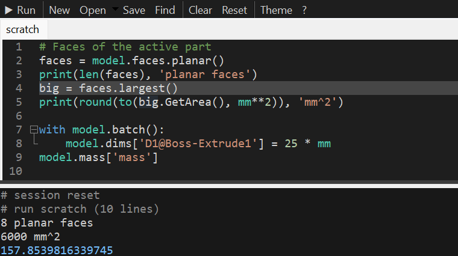

# SwPy - Python for SOLIDWORKS

SwPy embeds real CPython **inside SOLIDWORKS**: a script editor in the task pane with IntelliSense from
your live model, a Pythonic API for parts, assemblies and drawings, every SOLIDWORKS API library, pip
packages, events, script buttons, and remote control from Jupyter.



```python
with model.sketch(model.planes.front) as s:
    s.rect((0, 0), 100 * mm, 60 * mm)
model.extrude(s, 20 * mm)
model.fillet(model.edges.parallel(Z), 5 * mm)
model.export("bracket.step")
```

**[Download the latest release](https://github.com/muerus/SolidWorks-Python/releases/latest)** -
Windows 10/11 x64, SOLIDWORKS 2020 or newer, no admin rights and no Python install needed.

## User guide

| | |
|---|---|
| [1. Getting started](guide/01-getting-started.md) | Install, open the editor, run your first script |
| [2. The editor](guide/02-editor.md) | Tabs, IntelliSense, signature help, F1 API help, find/replace, shortcuts |
| [3. Scripting basics](guide/03-scripting-basics.md) | What is predefined in a script, sessions, output, errors |
| [4. The model API](guide/04-model-api.md) | Units, dimensions, global variables, batch edits, mass, face/edge queries |
| [5. The SOLIDWORKS API from Python](guide/05-solidworks-api.md) | Auto-typed objects, casts, enums, arrays, out-parameters, other API libraries |
| [6. Packages](guide/06-packages.md) | `# r: numpy` - pip packages in scripts |
| [7. Remote control](guide/07-remote-control.md) | Jupyter, scripts, Excel, C# |
| [8. Recipes](guide/08-recipes.md) | Copy-paste solutions |
| [9. Troubleshooting](guide/09-troubleshooting.md) | Logs and common errors |
| [10. Events](guide/10-events.md) | Run Python when SOLIDWORKS rebuilds, saves, selects |
| [11. Script buttons and user interaction](guide/11-scripts-and-ui.md) | Script folder, startup scripts, progress bars, dialogs |
| [12. Building models](guide/12-building-models.md) | Sketches, features, assemblies, drawings, export |
| [API reference](guide/api-reference.md) | Every public class and function |

[Source on GitHub](https://github.com/muerus/SolidWorks-Python) ·
[Changelog](https://github.com/muerus/SolidWorks-Python/blob/main/CHANGELOG.md) ·
[Architecture](ARCHITECTURE.md) ·
[Security](https://github.com/muerus/SolidWorks-Python/blob/main/SECURITY.md)
